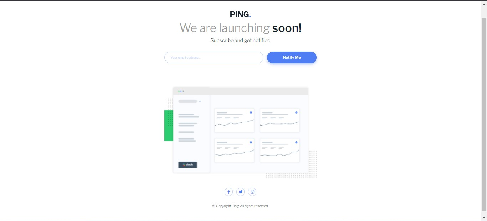

# frontend-mentor-challenge-15
frontend-mentor-challenge the link https://abubakr404.github.io/frontend-mentor-challenge-15/

# Frontend Mentor - Ping coming soon page solution

This is a solution to the [Ping coming soon page challenge on Frontend Mentor](https://www.frontendmentor.io/challenges/ping-single-column-coming-soon-page-5cadd051fec04111f7b848da). Frontend Mentor challenges help you improve your coding skills by building realistic projects. 

## Table of contents

- [Overview](#overview)
  - [The challenge](#the-challenge)
  - [Screenshot](#screenshot)
- [Author](#author)

## Overview

### The challenge

Users should be able to:

- See hover states for interactive elements

### Screenshot

## Author

- Frontend Mentor - [@abubakr404](https://www.frontendmentor.io/profile/abubakr404)